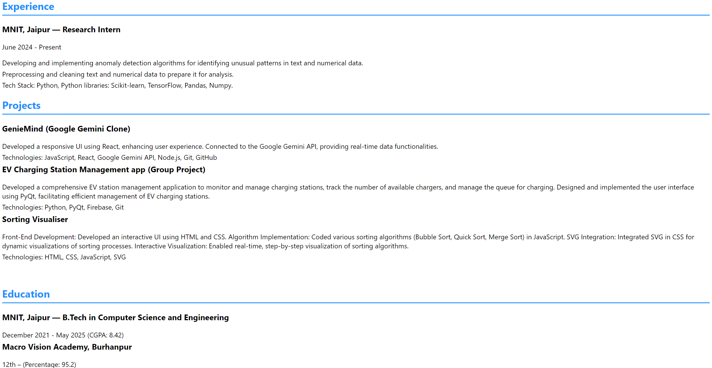

# Resume using React:
I have craeted my Resume using React and have hosted it using github pages:

## benifits:
-- The number of Resume files would decrease (since we update resume and download it everytime with every single change) 
-- adding changes is easy
-- can be shared directly and easily

### Image:

### `npm start`
Runs the app in the development mode.\
Open [http://localhost:3000](http://localhost:3000) to view it in your browser.

The page will reload when you make changes.\
You may also see any lint errors in the console.